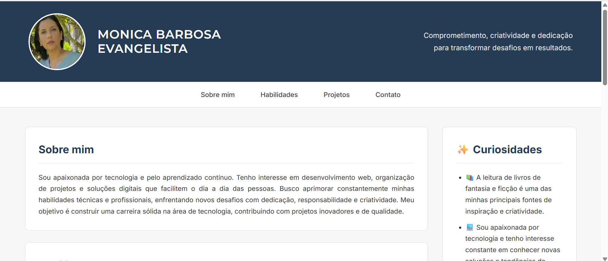

# Landing Page - Portfólio Pessoal

Uma Landing Page desenvolvida com **HTML5** e **CSS3** como atividade da disciplina de **Front-end** do curso de **Análise e Desenvolvimento de Sistemas (ADS) da UniCesumar**.

## 📷 Preview do Projeto



---

## 📌 Sobre o projeto

Este projeto foi desenvolvido com o objetivo de aplicar, na prática, os conhecimentos de HTML5 e CSS3 por meio da criação de uma Landing Page pessoal.

A página apresenta informações profissionais, habilidades e projetos de forma organizada, utilizando uma estrutura semântica e um layout responsivo para diferentes dispositivos.

---

## 👩‍💻 Sobre a autora

Meu nome é **Monica Evangelista** e sou estudante de **Análise e Desenvolvimento de Sistemas (ADS) na UniCesumar**. Tenho grande interesse por desenvolvimento web, tecnologia e aprendizado contínuo, buscando transformar conhecimento em projetos práticos e construir um portfólio sólido na área de tecnologia.

---

## 🚀 Tecnologias utilizadas

* HTML5
* CSS3

---

## 📋 Funcionalidades

* Apresentação pessoal
* Seção "Sobre mim"
* Seção de habilidades
* Seção de projetos
* Menu de navegação interno
* Informações de contato
* Layout responsivo

---

## 📁 Estrutura do projeto

```text
/
├── index.html
├── style.css
├── README.md
└── preview.png
```

---

## 🎯 Objetivo

Desenvolver uma Landing Page utilizando apenas HTML5 e CSS3, colocando em prática os conceitos de estrutura semântica, estilização e organização de conteúdo, além de contribuir para a construção do meu portfólio profissional.

---

## 📚 Disciplina

**Front-end**
**Curso:** Análise e Desenvolvimento de Sistemas (ADS)
**Instituição:** UniCesumar

---

## 📄 Licença

Projeto desenvolvido para fins acadêmicos e de aprendizado.
